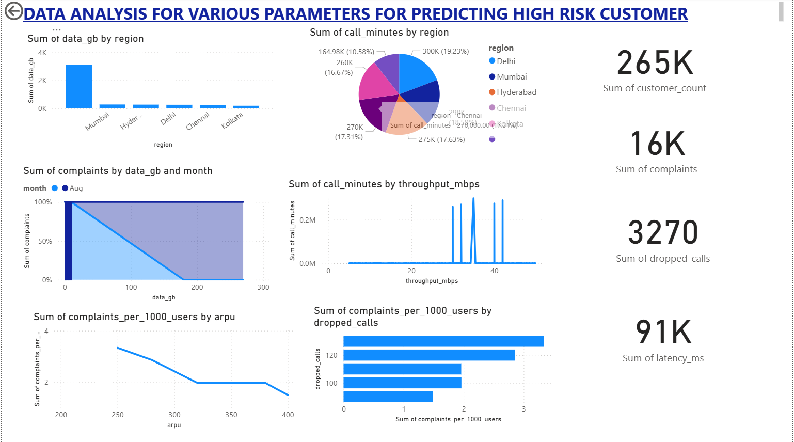

[View the deployed web app](https://telecomrevenuegrowthanalysis-4f5vwnsgw4df3wah9hnqqh.streamlit.app/)

# 📊 Telecom Revenue Growth Analysis

This project analyzes telecom customer data to uncover **revenue growth opportunities** using **customer segmentation and behavioral clustering**.  
The goal is to help telecom companies understand customer usage patterns, identify high-value segments, and optimize pricing or marketing strategies.

---

## 🚀 Project Overview

This notebook performs:
- **Data preprocessing and cleaning**
- **Feature engineering** using telecom KPIs like monthly data usage, voice minutes, and spending
- **K-Means clustering** to group customers based on usage and spending behavior
- **Cluster-wise insights** on revenue contribution, usage efficiency, and potential growth areas

---

## 🧠 Key Insights

The analysis identifies **five major customer clusters**, such as:
| Segment | Description |
|----------|--------------|
| **High-Value Users** | Heavy data users with high spending — major revenue contributors. |
| **Data-Efficient Users** | Get high data value at low cost — potential for premium plan upsell. |
| **Budget Users** | Low usage and low spend — focus for retention or cross-selling. |
| **Voice-Heavy Users** | Prefer calling plans — opportunity for combo offers. |
| **Professional Data Users** | Spend more with low voice usage — likely business customers. |

---

## 🧩 Features Used

### 📈 Numerical Features
- `MonthlyDataGB`
- `MonthlyVoiceMins`
- `MonthlySpendRs`
- `DataGB_Last3Mo_Avg`
- `SpendRs_Last3Mo_Avg`
- `DataGB_SpendRs_Ratio`

### 🗂️ Categorical Features
- `PlanType`
- `Region`
- `DeviceType`

---

## ⚙️ Tech Stack

| Category | Tools / Libraries |
|-----------|-------------------|
| Language | Python |
| Data Handling | Pandas, NumPy |
| Visualization | Matplotlib, Seaborn |
| Machine Learning | Scikit-learn (KMeans, Pipeline, Preprocessing) |
| Notebook | Jupyter Notebook |

---

